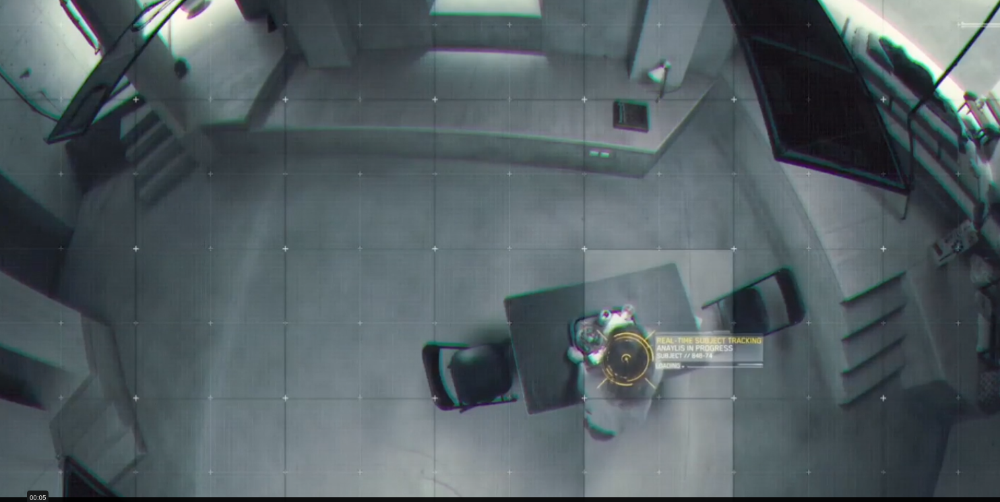
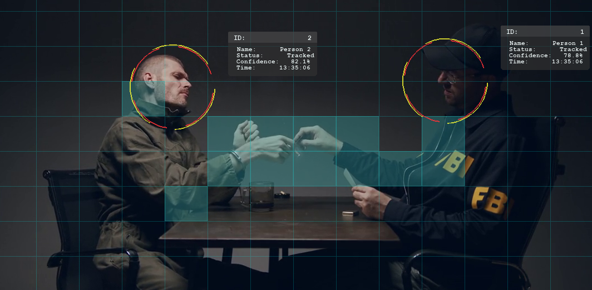

# High-Tech Camera Overlay System

A customizable video feed overlay system that creates a visual interface on camera feeds. It features animated grid cells that highlight when motion is detected, head tracking with animated reticles, and "informational displays" for identified persons.

### Purpose

After seeing the movie "Morgan", I wanted to make something neat like their camera overlay. This is just for fun.

From the movie "Morgan":


This system:  



https://github.com/user-attachments/assets/580d2d14-7af3-4de7-b6f0-e90c01a90f21

## Features

- Dynamic grid overlay with customizable dimensions
- Motion detection with animated grid cell highlighting
- Head tracking with animated reticle
- Person identification display panel
- Support for external motion detection data sources (ONVIF, object detection models)
- Highly customizable visual elements
- GPU acceleration support

## Installation

```bash
# Using uv (recommended)
uv pip install -r requirements.txt

# Or using pip
pip install -r requirements.txt
```

## Usage

```bash
# Run with default settings
./overlay_app.py

# Run with custom settings
./overlay_app.py --source 0 --grid-cols 9 --grid-rows 5

# Run with video example
./overlay_app.py --source ./path/to/video.mp4
```

## Configuration

Configuration can be done via command line arguments or by editing the `config.yaml` file.

See `config.yaml` for all available options.

## Hardware Support

- AMD GPUs (via OpenCL)
- NVIDIA GPUs (via CUDA)
- NVIDIA Jetson (optimized support)

## Docker Support

Docker configurations are available for different hardware platforms:
- `docker-compose.yml` - Basic setup
- `docker-compose.nvidia.yml` - NVIDIA GPU support
- `docker-compose.jetson.yml` - Jetson device support
